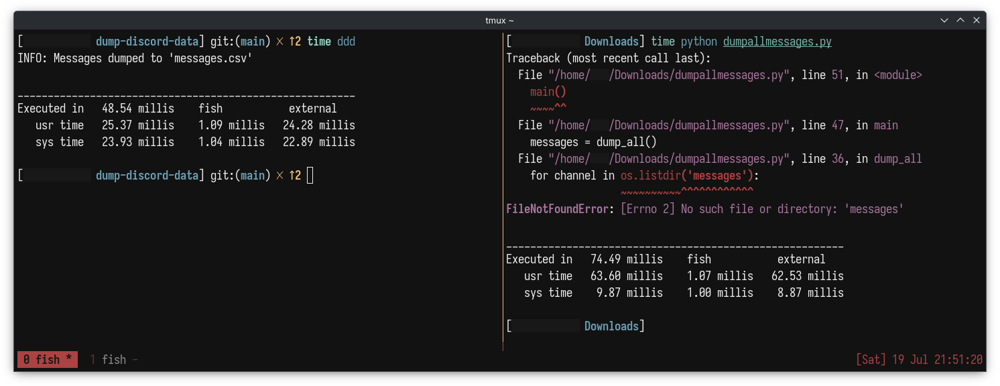

# dump-discord-data

dump-discord-data (ddd) dumps your requested Discord data (from Messages folder) into a CSV format that can be submitted to request a GDPR deletion of your Discord messages.

## build

to build yourself:

```console
$ go build ddd.go
```

or, download latest version from [Releases](https://github.com/misokt/ddd/releases)

## usage:

dump all messages from default path:
```console
$ ddd.exe
```

dump all messages from specific year:
```console
$ ddd.exe -year 2018
```

dump all messages excluding/including 1 channel:
```console
$ ddd.exe -exclude -channels 123123123123123
$ ddd.exe -include -channels 100101018101001
```

dump all messages excluding/including multiple channels:
```console
$ ddd.exe -exclude -channels 234234234234234,345345345345345
$ ddd.exe -include -channels 456456456456456,567567567567567
```

dump all messages only from specified channels from a specified year:
```console
$ ddd.exe -include -channels 678678678678678,789789789789789 -year 2023
```

dump all messages from a specified path:
```console
$ ddd.exe -path /path/to/Messages/folder
```

## directory structure

where the executable should be placed:
```
.
└── /
    ├── ddd.exe
    ├── Messages/
    └── README.txt
```

- it is okay to have multiple folders where `ddd.exe` is. program will specifically look for "Messages" folder.
- in case of different language or "Messages" folder can't be found, the program will try to search for the right folder.

    - if it finds the right folder, messages will be dumped from it.
    - if it does not find the right folder, you can use the `-path` flag to pass in the folder that has the Messages. refer to the [usage](#usage) section.

## (re)-written in go because:

- I wanted to.
- its easier to distribute a compiled binary that won't require additional installations.
- uses flags instead of multiple scripts.
- I can blindly trust it now and any subsequent future changes because I created it.

## exec time differences:

python script takes longer to fail than it takes for `ddd` to dump all messages:



(the python script is failing because it checks for lowercase "messages" folder but Discord provides capitalied "Messages" folder.)

previous version comparision in here: [images](./images)

## credits:

to & inspired by the python script: [ishnz/bulk_deletion_helper](https://github.com/ishnz/bulk_deletion_helper) *

\* note: this python script does not work out of the box at the time of writing this.
